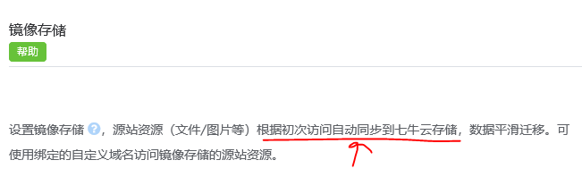

### 思科 cisco

* Wireshark插件

    Wireshark是一个网络数据包的分析软件，虽然已经支持数千种协议，但是对于cisco 内部使用的一些协议，Wireshark 还没有办法解析。如果想要解析自定义协议的数据包，可以使用lua编写Wireshark的插件，是其可以解析自定义协议的数据包。

* teacat 开发

    teacat 是cisco 内部对基于Python的路由器或交换机的镜像文件进行自动化测试的项目名的简称。
    
    使用Python远程连接到路由器的集群上面，根据需求搭建相应的测试的网络模型，对相关的路由器使用python进行自动化的配置，最后通过网络的状态和相关路由器的状态来判断这个版本的系统镜像是否对是暴露出来的bug完全的修复。

### 哔哩哔哩 bilibili 

* 使用nginx + lua 开发支持高并发的Web接口

    ngx_lua是Nginx的一个模块，将Lua嵌入到Nginx中，从而可以使用Lua来编写脚本，这样就可以使用Lua编写应用脚本，部署到Nginx中运行，这样就可以使用Lua语言开发高性能Web应用了。

    Web应用的业务逻辑是，对于一个访问源站的视频请求，如果这个视频被请求的次数超过了某个次数，那么这个视频是一个热点的视频，需要将这个视频分发到cdn服务商的服务器里面。

    业务逻辑如下：
        
    1. 解析url的post请求里面的参数，拿到对应请求的视频id

    2. 对于一个视频id，通过redis来记录它的请求次数，如果超过某个值就认为这个视频是一个热点视频，需要存放到cdn服务商的服务器中。

    3. 如果对于当前视频id，它需要被放到cdn服务器中，对视频id进行哈希取余操作 (如： hash(id)%1000 )，计算出将当前视频需要分配到哪一个cdn的服务商的服务器中。

    4. 如何将视频分发到cdn中？
        
        cdn服务商（以七牛云为例）提供了镜像存储的服务，如下图所示。利用镜像存储，可以将源站的视频拖到cdn服务商的服务器中。向cdn发送一个当前视频的http请求，cdn会自动的从源站把视频拖过来。
         

    5. cdn从源站拖视频的时候，需要设计一个http的请求的参数来防盗链。比如：
        ```
        http://源站ip/path?query=参数
        
        #参数=hash(当前时间+有效期，path，secret_key)
        ```
    
    * 难点（对于我来说）

        1. 使用在nginx + lua脚本开发web应用，需要熟悉nginx的基本原理和如何在nginx下嵌入lua脚本来开发web应用。
    
        2. 使用lua脚本开发web应用，更多的是看重lua语言效率比较高的优点，但是使用lua进行web开发并不像php一样有很多成熟的内置函数和库，比如进行md5加密的函数和发送http请求的函数，甚至是ip_to_long这样的函数，lua里面都需要自己来实现。
        

       