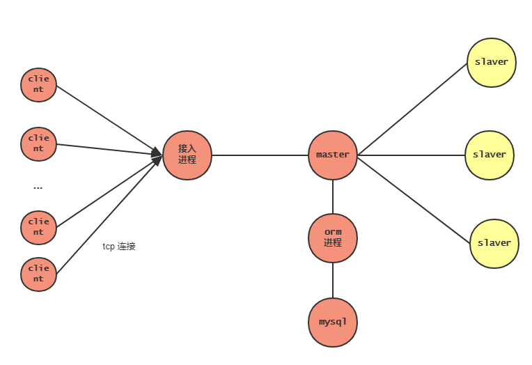
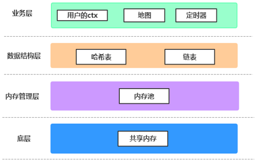

## 腾讯

在腾讯的实习是在北极光工作室，实习的主要工作是做一个游戏后台开发的mini练习。

* 这个练习的大概任务如下：

    * [Step 1] 使用提供的公共组件，实现一个简易游戏的后台框架

        这一块主要熟悉一些公共组件，相当于帮助我实现了接入服务，orm服务，log服务，需要我完成的是设计和实现master进程和slaver进程，以及自己设计通信协议和客户端。
    
        搭建的后台框架如下图所示：
        

    * 主要的逻辑功能有：

    1. 设计clinet的登陆接口

    3. 实现登陆之后，为当前用户创建上下文环境，然后将用户切换到另一个进程上面。

        因为只有一个master 进程负责全局的管理和维护，对于登陆上来的用户的具体逻辑操作，要把这些服务 切换到其他的进程上面。主要的原因有两个，第一个是逻辑操作的代码很有可能是不可靠的，需要把它单独拿出来，避免逻辑操作core掉，然后整个服务跟着一起core掉。第二个原因是，我的理解是，负载均衡。不同的用户分散到不同的进程上面，避免一个点的压力过大。

    4. 切换路由

        一个用户登陆上来之后，被从master进程，切换到其他的进程上面执行逻辑操作。这个时候，他和client的交互就需要切换路由，重新建立新的连接，来绕过master进程。
        这其实是一个有两个好处，第一个是master的进程，作为整个服务的单点，为了避免它core掉，尽可能的让它上面的逻辑简单，只负责维护全局信息，干活的事情，交给slave进程。
        第二是，master和多个slave 也可以实现负载均衡，一个slave 挂掉对全局的影响不是很大。

    5. 登陆，查询db，把user的信息切换到其他进程上面 这些都是异步操作。

        对于这些操作，它们一定要是异步的。不可能卡在这里等这个操作结束，然后返回一个结果。这个同步的代码是不可以写的，必须要异步。但是异步的代码就面临的问题是逻辑会更加复杂。一个简单的登陆，查询db的基本操作，代码量就是一千多行。
        所以，这个应该是有两个办法去解决，一个是使用协程，一个是使用状态机的设计模式来维护代码，提高代码的可读性和可维护性。（但是后面我发现就连的我的代码，都是十几个状态，我自己都有些看不懂了）
        不过这个用状态机fcm的设计模式重构代码的时候，还是学到了很多的东西。第一次把设计模型的思想用来代码里面，然后就是对同步，异步，这些课本上“考点”多了一些深入的思考和理解。
        
    6. 移动和视野模块

        实现一个地图模块，而且client可以在地图上面移动，但是只能看见自己周围的人。

*  [Step 2 自己去实现游戏框架的组件]

    第二部分的练习就很有意思了，这一部分是自己去实现一个组件，替换原有的的组件。
    
    #### 实现一个可以reusme的内存池 ####
    
    这个是一个很有意思的东西，实现一个内存池。但是，这个内存池有一个要求，就是进程挂了之后，重新启动起来，内存池上面的数据还是存在的。这其实是一个容灾的方案设计，是一种进程恢复的技术。这个对服务器的设计非常重要。

    举一个例子，如果程序里面有一个map，然后向map写入一个uid=100的user。然后程序被kill了。重新启动之后，要求这个map里面的数据依然是存在的，并且依然可以读取出来。

    解决的办法是：

    使用共享内存。一个进程起来之后，将自己的内存池创建再共享内存上面，这样程序挂了之后，共享内存上面的数据是依然存在的。下次启动的时候，shmat一下就好。这个数据就不会丢失了。但是，这样只是数据不会丢失了，但是也只是数据还在，怎么样读出来，就又是问题了。举个例子。
    
    比如，如下的问题：
    1. 共享内存每次shmat的时候，是挂在进程的虚拟内存空间上面的，但是每次挂载的地址是不一样的。也就是说，你的内存池里面是不能使用指针的，因为挂在的地址再进程重启之后是不一样的。
    
        举个例子，如果一个 strcut user * p_uesr 指向了内存池上面的一个空间，然后进程重新启动之后，共享内存挂载的地方可能是不一样的。这样就导致，p_user去访问的空间以前不是原来的空间。

    2. 实现共享内存的内存池之后，后面的所有数据结构（重启进程之后恢复不出来的）都要放在内存池里面。这样就必须再内存池的基础上面去实现相应的数据结构，比如去实现链表，实现hash_table。基本告别stl。

        解决的办法，我就不在这里详细的写了。内存池的部分，我的设计是如下：
        
        

    这个事情是一个很有挑战的事情，也是一个很开心的事情。写这个模块的时候，非常爽，感觉自己在完成一个了不起的大事，写的很有成就感。
    
    #### 实现一个linux下的定时器 ####

    这个timer就是仿照linux下面的定时器的实现，做一个多级时间轮。实现定时任务。写这个时候，看了一些linux的源码和相关的资料，发现linux下面的很多东西写的都非常好，可以指的学习一下。

    #### 实现一个对后台进行并发压测的client ####

    以前看过webbench的源码，这个压测的思路和webbench也差不多。我是通过多线程去建立连接，然后进行io，然后断开。

* [Step 3 替换原有的游戏服务框架]

    这一部分的主要任务是把原来的使用的游戏服务的组件 :把之前用到公共组件，比如：接入服务的进程和消息队列，自己去实现一个相似的功能，然后替换。

    * 实现一个基于共享内存的消息队列

    * 实现一个基于epoll的接入服务进程    
