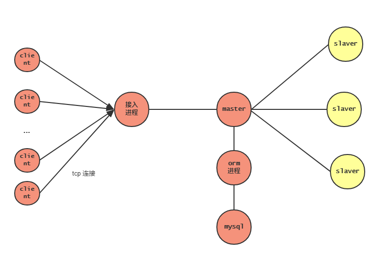
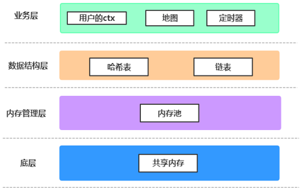

## MINI-GAME  C++的高性能游戏服务器设计

在腾讯的实习是在北极光工作室，为期三个月完成mini game项目，一个基于c++的高性能游戏服务器。

#### 1. 架构设计：

* 后台服务框架如下图所示：

    包括一个master进程，和多个slaver进程。另外，使用了公司提供的公共组件，消息队列，序列化工具，接入服务，orm工具，log工具等实现了一个游戏后台服务框架。

    搭建的后台框架如下图所示：
    

* 高性能服务器设计的要求：

    1. 全异步的设计

        基于消息驱动 + 状态机实现全异步的后台服务器。

        比如，对于查询db或者两个进程之间请求和处理相应，对于这些操作，它们一定要是异步的。不可能卡在这里等这个操作结束，然后返回一个结果。但是，异步的代码就面临的问题是逻辑会更加复杂，需要拆分出来req和rsp。

        所以，这个应该是有两个办法去解决，一个是使用协程，一个是消息驱动 + 使用状态机的设计模式实现，状态机模式保证了在异步的条件下代码的可读性和可维护性。

    2. 基于共享内存的内存池容灾设计

        对于有状态的服务器开发，必须要考虑的问题是，服务器core掉了，还没有持久化的数据或状态要如何处理。

        在这里设计了基于共享内存的内存池，服务器运行的全部状态信息和玩家数据都存放在基于共享内存的内存池上面。当服务器进程挂掉，共享内存并不会被回收，程序重新启动直接attach内存池，所有的数据和状态都不会丢失。对于服务器宕机而言，可以实现秒级的恢复。

    3. master + 多个slave进程的架构设计

        一个master 进程负责全局的管理和维护，对于对于登陆上来的用户的具体逻辑操作，要把这些玩家切换到其他的slave上面。一个用户登陆上来之后，被从master进程，切换到其他的slave进程上面执行逻辑操作。这个时候，slvae和client的交互就需要切换路由，重新建立新的连接，来绕过master进程。

        这其实是一个有两个好处，第一个是master的进程，作为整个服务的单点，为了避免它core掉，尽可能的让它上面的逻辑简单，只负责维护全局信息，干活的事情，交给slave进程。
        第二是，master和多个slave 也可以实现负载均衡，一个slave挂掉对全局的影响不是很大。

    4. 实现防止crash的定时器

        实现一个基于时间轮的定时器，实现定时任务。同样，这个定时器也是建立在共享内存上面的，如果定时器core掉，那么可以立即拉起，定时器上面的任务完全不受影响。

    5. 压测工具

        设计了一个类似于webbench的压测工具，模拟千人登陆的游戏的场景，对服务器进行测试。

#### 2. 实现细节
基于共享内存的内存池设计，这个是一个很有意思的东西。内存池有一个要求，就是进程挂了之后，重新启动起来，内存池上面的数据还是存在的。这其实是一个容灾的方案设计，一种进程恢复的技术。这个对服务器的设计非常重要。

举一个例子，如果程序里面有一个map，然后向map写入一个uid=100的user。然后程序被kill了。重新启动之后，要求这个map里面的数据依然是存在的，并且依然可以读取出来。

解决的办法是：

使用共享内存。一个进程起来之后，将自己的内存池创建再共享内存上面，这样程序挂了之后，共享内存上面的数据是依然存在的。下次启动的时候，shmat一下就好。这个数据就不会丢失了。但是，这样只是数据不会丢失了，但是也只是数据还在，怎么样读出来，就又是问题了。举个例子。

比如，如下的问题：

1. 共享内存每次shmat的时候，是挂在进程的虚拟内存空间上面的，但是每次挂载的地址是不一样的。也就是说，你的内存池里面是不能使用指针的，因为挂在的地址再进程重启之后是不一样的。

    举个例子，如果一个 strcut user * p_uesr 指向了内存池上面的一个空间，然后进程重新启动之后，共享内存挂载的地方可能是不一样的。这样就导致，p_user去访问的空间以前不是原来的空间。

2. 实现共享内存的内存池之后，后面的所有数据结构（重启进程之后恢复不出来的）都要放在内存池里面。这样就必须再内存池的基础上面去实现相应的数据结构，比如去实现链表，实现hash_table。基本告别stl。

    解决的办法，我就不在这里详细的写了。内存池的部分，从底层到业务层的逻辑大致如下：
    

这是一个为期三个月需要独立完成的练习项目，在这个项目中，除了需要完成功能上面的需求外，还有很多性能，容灾，可扩展上面的要求。完成这个项目后，感觉自己的编码能力，gdb debug 能力有了很大的提高，还学习到了很多设计“高性能”的服务器开发的经验。